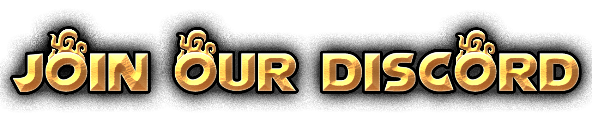
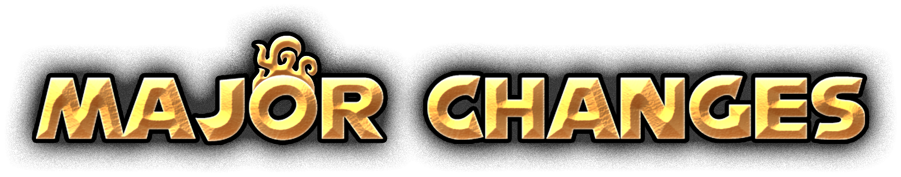

<h1 align="center"></h1>
A Fan Remake of Sonic and the Secret Rings.

Originally released in 2007 for the Nintendo Wii, Sonic and the Secret Rings' initially saw a moderate amount of critical and commercial success. Despite this, its reputation has dwindled over time among fans. Some commonly cited complaints include:
 - Imprecise motion controls
 - Repetitive music
 - Unnecessary skills
 - Nonsensical level progression.

While this remake intends to remain largely faithful to the original ideas of Secret Rings, many things will be changed to create a more enjoyable experience.

<h1 align="center"></h1>

<h1 align="center"></h1>

- Controls will be remapped for a traditional controller.
- Level Select will have an indication for story-critical missions.
- "Seven Rings in Hand" will no longer be the menu theme.
- Equipping Skill Rings before a mission will be skipped by default.
- Skills that improve control will be equipped by default.
- Skills that are weaker versions of other skills will be removed.
- Time Break will maintain a smooth framerate.

<h2>DISCLAIMER</h2>

**Sonic and the Secret Rings** is copyrighted by SEGA. I am not affiliated or endorsed by SEGA in any way.
This Fan Remake is distributed as **freeware**, and *should not be sold under any circumstances.*

The game has been built with [**Godot Engine**](https://godotengine.org/)

<h2> </h2>

If you want to contribute to the project, or simply want access to the latest nightly builds, you can check out the wiki [here](https://project-reignition.gitbook.io/wiki/).
